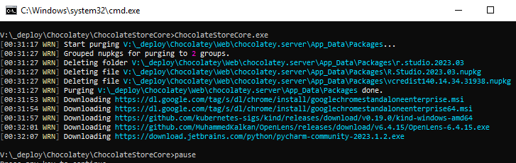

ChocolateStoreCore
==================
*Based on the idea of the [ChocolateStore](https://github.com/BahKoo/ChocolateStore) application by [BahKoo](https://github.com/BahKoo)*  
  
### Summary
Download, modify and cache chocolatey packages locally to be delivered through a local repository including binary downloads.  

### License
Apache 2.0

### Compilation requirements
* Visual Studio 2022
* .NET 6.0

### Package dependencies
```
- CommandLineParser
- Newtonsoft.Json
- NuGet
- Polly
- Serilog
- (Test) AutoFixture
- (Test) FluentAssertions
- (Test) Moq
- (Test) xunit
```

### Syntax
Run `ChocolateStoreCore.exe` with existing `appsettings.json` configuration in same folder as the exe file and optional additional processing flags  
* `-p or --purge` purge only  
* `-w or --whatif` no writing or deletion of files  

### Configuration
#### `appsettings.json` example
```
{
  "ChocolateyConfiguration": {
    "LocalRepoUrl": "http://localhost:8080",
    "ApiUrl": "https://community.chocolatey.org",
    "ApiUserAgent": "User-Agent: ChocolateStoreCore",
    "ApiPath": "/api/v2",
    "ApiPackageRequest": "/Packages()?$filter=(tolower(Id)%20eq%20'{0}')%20and%20IsLatestVersion",
    "ApiPackageRequestWithVersion": "/Packages()?$filter=(tolower(Id)%20eq%20'{0}')%20and%20version%20eq%20'{1}'",
    "ApiFindAllRequest": "/FindPackagesById()?id='{0}.app'",
    "ApiFindAllNextRequest": "/FindPackagesById?id='{0}'&$skiptoken='{0}','{1}'",
    "ApiGetRequest": "/package/{0}/{1}",
    "OptionalRemoteDownloadUrl": "https://packages.chocolatey.org/{0}.{1}.nupkg",
    "FolderPath": "c:\\ChocolateyStore_Packages",
    "DownloadListPath": "c:\\ChocolateyStore_Packages\\download.txt",
    "HttpTimeout": "5",
    "HttpTimeoutOverAll": "10",
    "HttpRetries": "3",
    "HttpHandlerLifetime": "10",
    "LogFile": "log.txt",
    "LogLevel": "Warning"
  }
}
```

| parameter             | description |  
| :---                  | :--- |  
| `LocalRepoUrl`        | url of the local webserver / repository where the binaries are to be downloaded from |  
| `FolderPath`          | file location to cache the nupkg files and optional folders for download artefacts |  
| `DownloadListPath`    | file location for the file containing the desired chocolatey ids (one line for each id) |  
| `HttpTimeout`         | [s] |  
| `HttpTimeoutOverAll`  | [min] |  
| `HttpHandlerLifetime` | [min] |  
  
#### `download.txt` example 
```
googlechrome
nodejs
sysinternals
```

### Output
Example output:  


### Alternative
Chocolatey's (business edition) own feature ['Package Internalizer'](https://chocolatey.org/docs/features-automatically-recompile-packages).
